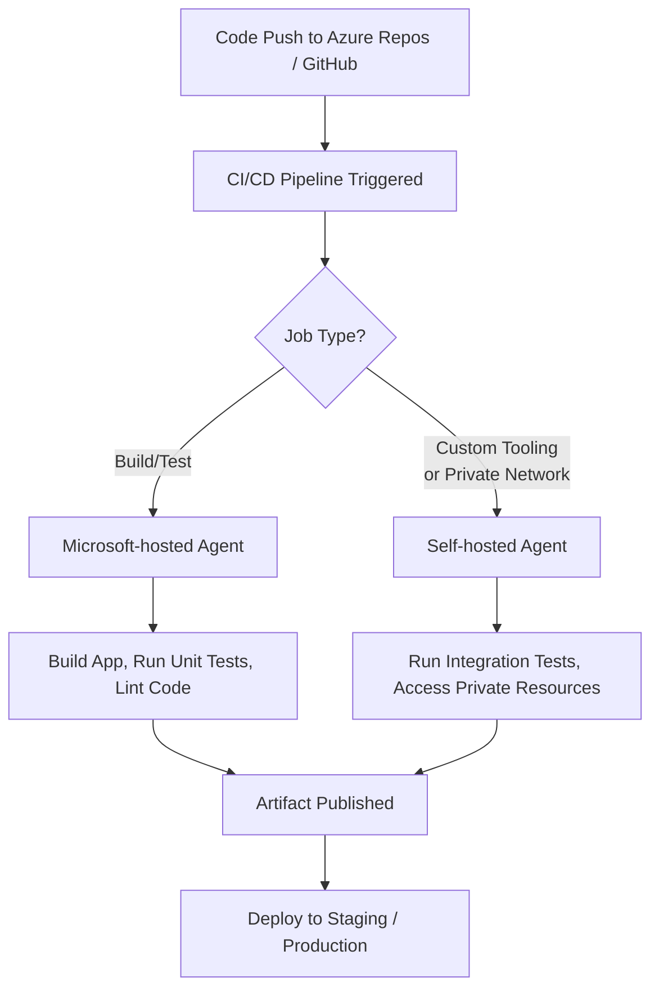

# Azure-Managed-DevOps-Pools

Azure Managed DevOps Pools—also referred to as **Microsoft-hosted agents** in **Azure DevOps**—are virtual machines provided and maintained by Microsoft to run your CI/CD pipelines. Here's a breakdown of the **pros and cons** of using them:

---

### ✅ **Pros of Azure Managed DevOps Pools (Microsoft-hosted agents)**

| **Advantage** | **Details** |
|---------------|-------------|
| **No Maintenance Overhead** | Microsoft manages patching, updates, and VM provisioning. You don’t worry about the underlying infrastructure. |
| **Quick to Get Started** | No setup required. Pipelines can be configured to use managed pools out-of-the-box. |
| **Scalability** | Scales automatically based on job demand—no need to pre-scale or manage agent pools. |
| **Security Isolation** | Each pipeline run gets a fresh VM instance, reducing the risk of data leakage between builds. |
| **Updated Toolsets** | Comes pre-installed with commonly used SDKs, compilers, and build tools (e.g., .NET, Node.js, Python, Java, Docker). |
| **Cross-Platform Support** | Offers Windows, Ubuntu, and macOS agents to support diverse development needs. |
| **Consumption-Based Billing** | Only billed for pipeline minutes (when using Microsoft-hosted parallel jobs) under paid plans—great for optimizing cost in smaller workloads. |

---

### ❌ **Cons of Azure Managed DevOps Pools**

| **Limitation** | **Details** |
|----------------|-------------|
| **Cold Start Time** | Each job starts a new VM which can lead to slower startup times (~1–3 mins). |
| **Ephemeral Agents** | No persistence—build artifacts or environment changes must be stored externally (e.g., Azure Artifacts, Storage). |
| **Limited Customization** | You can't customize the base VM image deeply; installing extra tools increases job time. |
| **Job Timeout Limits** | Microsoft-hosted agents have a default timeout limit (e.g., 60 mins), which may not suit long-running jobs. |
| **Limited Parallelism (Free Tier)** | Free tier includes only **1 parallel job** with limited minutes; additional jobs require a paid plan. |
| **macOS Cost** | macOS-hosted agents are more expensive and limited in availability compared to Windows/Linux. |
| **Dependency on Microsoft Availability** | If the DevOps service or VM provisioning is down in a region, builds will be delayed or fail. |

---

### 💡 **Use When...**
- You're just getting started or don’t want to manage infrastructure.
- Your builds are quick and relatively simple.
- You want a clean, secure environment for each run.

### 🚫 **Avoid When...**
- You need custom environments (e.g., special tools, licenses).
- You have long-running, compute-heavy pipelines.
- You need more predictable execution times and control (consider **self-hosted agents** in those cases).

---

Perfect. Here's a **side-by-side comparison** between **Azure Managed DevOps Pools (Microsoft-hosted agents)** and **Self-hosted DevOps Pools**:

---

### 🔁 **Azure DevOps Pools Comparison Table**

| Feature / Aspect | **Microsoft-hosted Agents (Managed Pools)** | **Self-hosted Agents (Custom Pools)** |
|------------------|----------------------------------------------|----------------------------------------|
| **Provisioning** | Fully managed by Microsoft | You provision and manage the agents |
| **Startup Time** | Slower (cold start VMs ~1–3 min) | Faster (agent always running) |
| **Customization** | Limited; can install during job | Full control over software, tools, hardware |
| **Persistence** | Ephemeral (clean VM per job) | Persistent state between builds (optional) |
| **OS Support** | Windows, Linux, macOS | Any OS you support (e.g., Windows Server, Ubuntu, RHEL) |
| **Scalability** | Auto-scales with Microsoft’s infra | You must scale agents manually or via automation |
| **Cost** | Billed per pipeline minute (unless under free tier) | Billed based on your VM/infra cost |
| **Security** | High isolation (new VM per run) | Risk of data leakage between builds if not cleaned |
| **Tooling** | Pre-installed toolchain, auto-updated | You manage all updates and installs |
| **Use of Private Network/Resources** | Limited unless using Azure DevOps Private Agents with Private Link | Full access to on-prem or private cloud resources |
| **Agent Maintenance** | None (Microsoft handles it) | You handle OS patches, tools, agent upgrades |
| **Job Parallelism** | Limited in free tier; pay per concurrency | Unlimited parallel jobs (if you scale infra) |
| **Reliability** | Depends on Microsoft’s pool availability | You own reliability and availability setup |

---

### ✅ **Choose Microsoft-hosted (Managed Pools) if:**
- You want quick setup with no infrastructure maintenance.
- You’re running public cloud workloads only.
- Your build/test pipeline doesn’t require deep customization.
- You’re using ephemeral environments for clean builds.

---

### ✅ **Choose Self-hosted Pools if:**
- You need specific hardware (e.g., GPU, more RAM).
- You want faster build times with persistent agents.
- You need access to private network resources or on-prem systems.
- You want to save money in high-volume pipelines.

---

Great! Here's a **hybrid DevOps agent strategy** combining **Microsoft-hosted** and **self-hosted agents**, tailored for flexibility, speed, and secure resource access.

---

### 🧩 **Hybrid Azure DevOps Agent Strategy Overview**

#### 🛠️ **Workflow Design**

---

### ⚙️ **Division of Responsibilities**

| **Agent Type** | **Use Cases** | **Rationale** |
|----------------|---------------|----------------|
| **Microsoft-hosted Agents** | - Build - Unit Testing - Static Code Analysis - Linting | Fast provisioning, clean environments, no infra to maintain |
| **Self-hosted Agents** | - Integration Tests - Performance/Load Testing - Private API or database access - Specialized tools (e.g., SAP, Oracle clients) - GPU-intensive jobs | Full customization, private VNet access, persistent environments |

---

### 🔐 **Security Tips for Self-hosted Agents**
- Run agents in a locked-down subnet with NSG rules.
- Use Managed Identity to access Azure resources securely.
- Clean up temp files and credentials between jobs to prevent leakage.
- Monitor agent health and logs with Azure Monitor + Log Analytics.

---

### 💵 **Cost Efficiency Consideration**

| Scenario | Recommendation |
|----------|----------------|
| 💡 **Low Volume CI/CD** | Stick mostly to Microsoft-hosted agents |
| 🚀 **High Volume Pipelines** | Self-hosted agents (e.g., on Spot VMs or Kubernetes) to reduce pipeline minute costs |
| 🔒 **Private Resource Access Required** | Self-hosted agents within a private VNet or hybrid network |
| 🎛️ **Custom Tooling/Legacy App Builds** | Self-hosted with pre-installed tools and licenses |

---

### 🧰 Optional Enhancements
- Use **Azure Scale Set Agents** for autoscaling self-hosted agents in Azure.
- Leverage **Azure Pipelines Deployment Groups** to target self-hosted VMs by role (e.g., DB-test, performance).
- Monitor pipeline runtime to determine which jobs can be optimized or offloaded.

---

